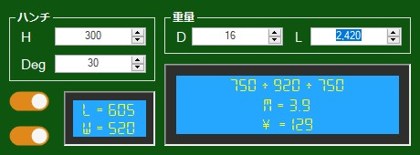

# REBAR WEIGHT TOOL
Tool help 西山 team of エマール group calculate 重量 of 鉄筋 from 文化シャッター partner.

## IMAGE DEMO
<p align='center'>
</img>
</p>

## CODE DEMO
```vb
''' <summary>
''' Check internet connection.
''' </summary>
''' <returns>Connection state.</returns>
Private Function IsNetAvail()
    Dim objResp As WebResponse
    Try
        objResp = WebRequest.Create(New Uri(My.Resources.link_base)).GetResponse
        objResp.Close()
        objResp = Nothing
        Return True
    Catch ex As Exception
        Return False
    End Try
End Function
```

### PACKAGES
</img>
<div style='display:flex;'>

- Tynab.YANF » 1.0.1

</div>